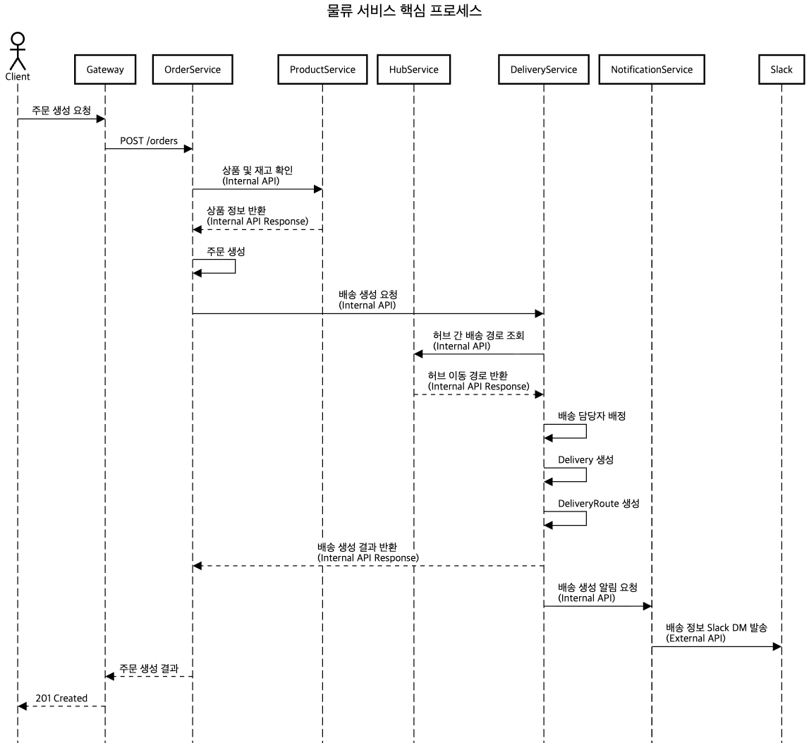
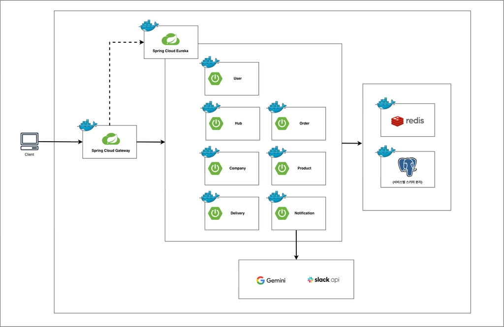

# if(true) Logistics

MSA 기반 B2B 물류 관리 및 배송 플랫폼입니다.

기업 간 주문을 기반으로 상품과 재고를 관리하고, 전국 허브를 연결해 주문 생성부터 허브 이동, 최종 배송, 알림까지의 물류 흐름을 처리합니다.

---

## 주요 기능

- 사용자 인증 및 역할 기반 접근 제어
- 허브와 허브 간 이동 경로 관리
- 업체 및 상품 정보 관리
- 상품 재고 확인 및 차감
- 주문 생성과 상태 관리
- 배송 및 배송 경로 관리
- 배송 담당자 배정
- Slack을 통한 배송 알림
- 서비스 디스커버리 및 API Gateway 라우팅
- Redis 캐시와 Zipkin 분산 추적

### 주문 및 배송 흐름

```text
주문 요청
  → 상품 및 재고 확인
  → 주문 생성
  → 출발·도착 허브 확인
  → 허브 간 이동 경로 조회
  → 배송 및 배송 경로 생성
  → 배송 담당자 배정
  → 배송 정보 알림
```

### 물류 서비스 핵심 프로세스



---

## 아키텍처



- Eureka를 이용한 서비스 등록 및 탐색
- Spring Cloud Gateway를 통한 외부 요청 진입점 통합
- REST API와 OpenFeign을 이용한 서비스 간 동기 통신
- `/api/v1/internal/**` 기반 내부 API 분리
- `X-Service-Key`를 이용한 내부 서비스 인증
- 서비스별 PostgreSQL 스키마 분리
- Redis 기반 데이터 캐싱
- Zipkin을 이용한 분산 요청 추적

---

## 서비스 구성

| 서비스 | 역할 |
| --- | --- |
| `eureka-service` | 서비스 등록 및 탐색 |
| `gateway-service` | 요청 라우팅, JWT 검증, 사용자 정보 전달 |
| `user-service` | 사용자 관리, 인증 및 토큰 관리 |
| `hub-service` | 허브 관리, 허브 간 이동 경로 관리 |
| `company-service` | 생산 업체와 수령 업체 관리 |
| `product-service` | 상품 및 재고 관리 |
| `order-service` | 주문 생성, 조회, 수정 및 취소 |
| `delivery-service` | 배송, 배송 경로 및 배송 담당자 관리 |
| `notification-service` | 배송 정보 알림 및 외부 메시지 연동 |

---

## 기술 스택

| 구분 | 기술 |
| --- | --- |
| Language | Java 17 |
| Framework | Spring Boot 3.5.16 |
| Build | Gradle |
| Database | PostgreSQL 16 |
| Cache | Redis |
| Database Migration | Flyway |
| Service Discovery | Netflix Eureka |
| API Gateway | Spring Cloud Gateway |
| Security | Spring Security, JWT |
| Service Communication | REST API, OpenFeign |
| Observability | Zipkin, Spring Boot Actuator |
| API Documentation | Swagger / OpenAPI |
| Infrastructure | Docker, Docker Compose |

---

## 권한 체계

| 역할 | 주요 권한 |
| --- | --- |
| 마스터 관리자 | 전체 서비스와 데이터 관리 |
| 허브 관리자 | 담당 허브, 업체 및 배송 담당자 관리 |
| 배송 담당자 | 할당된 허브 간 또는 허브·업체 간 배송 처리 |
| 업체 담당자 | 소속 업체 정보와 상품 관리 |

Gateway는 JWT 인증을 수행하고 사용자 ID와 역할을 각 서비스에 전달합니다. 실제 리소스 접근 권한은 각 도메인 서비스에서 검증합니다.

---

## 프로젝트 구조

```text
.
├── docker-compose.yml
├── infra/
├── postman/
├── eureka-service/
├── gateway-service/
├── user-service/
├── hub-service/
├── company-service/
├── product-service/
├── order-service/
├── delivery-service/
└── notification-service/
```

각 서비스는 독립적으로 빌드하고 실행할 수 있으며, 다음 계층을 중심으로 구성됩니다.

```text
presentation
application
domain
infrastructure
global
```

---

## 데이터 관리 정책

- 각 서비스는 독립된 PostgreSQL 스키마를 사용합니다.
- 서비스 간 데이터는 직접 참조하지 않고 내부 API로 조회합니다.
- 엔티티의 기본 키는 UUID를 사용합니다.
- 생성·수정·삭제 이력을 감사 필드로 관리합니다.
- 데이터 삭제는 기본적으로 Soft Delete 방식으로 처리합니다.
- 스키마 변경 이력은 Flyway로 관리합니다.
- JPA 스키마 설정은 `ddl-auto: validate`를 사용합니다.

---

## 실행 방법

### 사전 요구사항

- JDK 17
- Docker
- Docker Compose
- 프로젝트 루트의 `.env` 파일

`.env`에는 데이터베이스 접속 정보, JWT 설정, 내부 서비스 키와 같은 실행 환경별 설정이 포함됩니다. 민감한 설정은 Git에 커밋하지 않습니다.

### 전체 서비스 실행

프로젝트 루트에서 다음 명령을 실행합니다.

```bash
docker compose up -d
```

서비스 상태를 확인합니다.

```bash
docker compose ps
```

전체 서비스를 종료합니다.

```bash
docker compose down
```

### 개별 서비스 실행

각 서비스가 독립적인 Gradle 프로젝트이므로 해당 서비스 디렉터리에서 실행합니다.

```bash
cd hub-service

# macOS / Linux
./gradlew bootRun

# Windows
gradlew.bat bootRun
```

테스트는 다음과 같이 실행합니다.

```bash
cd hub-service

# macOS / Linux
./gradlew test

# Windows
gradlew.bat test
```

---

## API 및 내부 통신

외부 API 요청은 Gateway를 통해 전달됩니다.

```text
Client
  → Gateway
  → Domain Service
```

서비스 간 내부 통신은 `/api/v1/internal/**` 경로를 사용하며, `X-Service-Key` 헤더로 내부 요청을 인증합니다.

API별 상세 요청과 응답은 애플리케이션 실행 후 Swagger 문서에서 확인할 수 있습니다.

---

## 팀 if(true)

| 담당 영역 | 담당자 |
| --- | --- |
| 사용자, 인증, MSA 인프라 | 원영 |
| 허브, 허브 이동 경로 | 초인 |
| 배송, 배송 경로, 배송 담당자 | 태언 |
| 주문, 알림 | 원태 |
| 업체, 상품, 재고 | 동민 |
